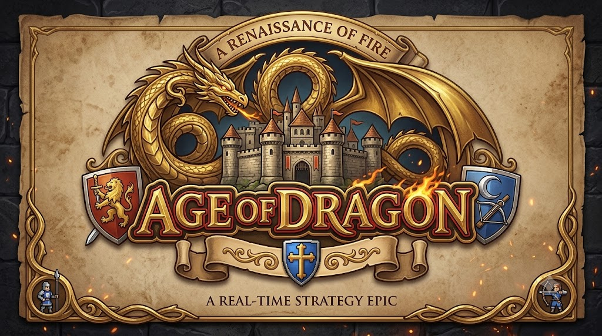
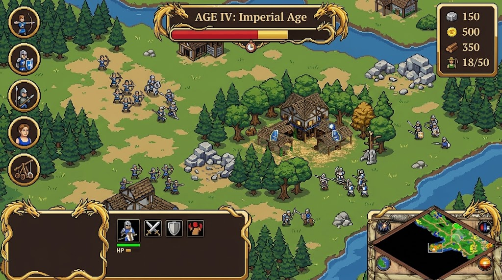
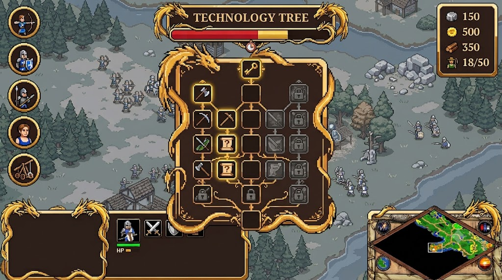
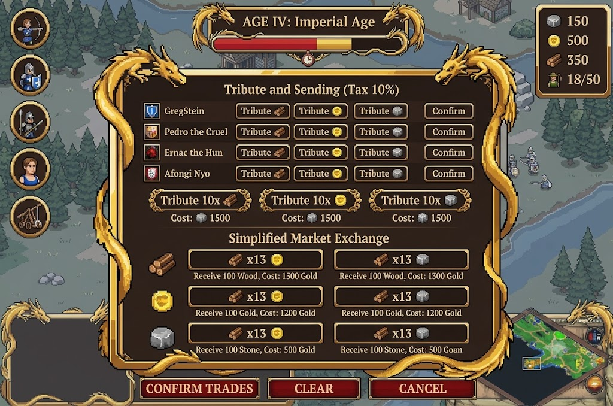
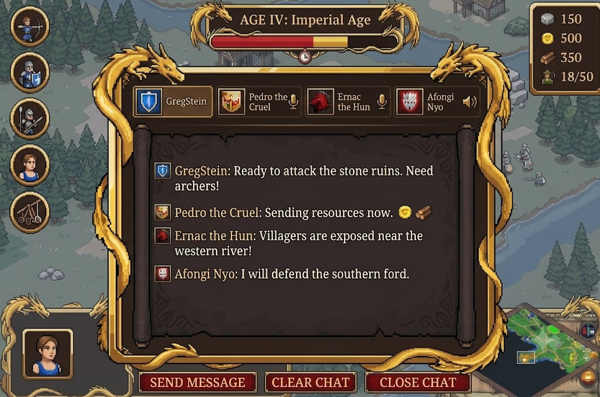
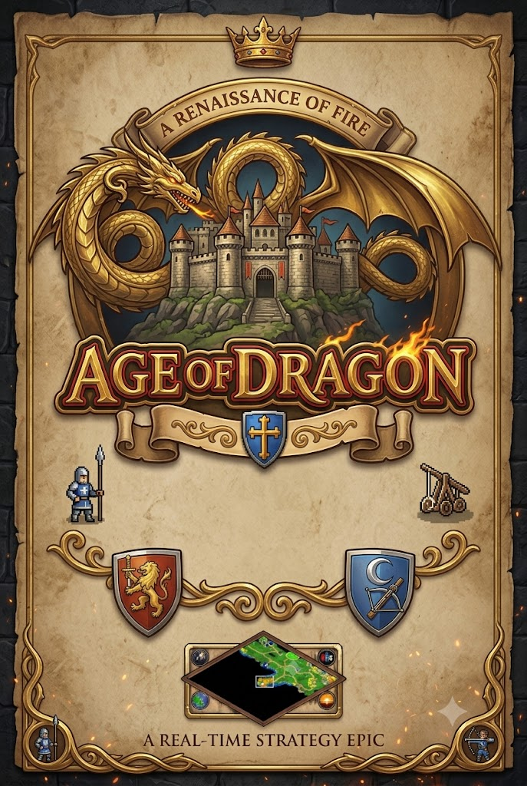

<p align="center">
  
</p>

<h1 align="center">Age of Dragon</h1>

<p align="center">
  <em>A real-time strategy epic — built for the phone first.</em>
</p>

<p align="center">
  <a href="LICENSE"></a>
  <a href="LICENSE-ART.md"></a>
  
  
</p>

---

> ### ⚠️ Read this first
>
> **There is no game to play yet.** AOD is at **phase 0.9 of 13** — the engineering
> foundation is built and proven on real hardware, but there is no map, no pathfinding,
> no buildings, no resources and no UI. What runs today is a headless simulation, a
> loopback network layer, and a 200-unit performance harness.
>
> Every image on this page is **concept art or a design mockup**, not a screenshot.
> They show where this is going, not where it is.

---

## What AOD aims to be

**Age of Empires II, with dragons, on a phone.**

That is the whole pitch. The proven RTS formula — villagers, resource gathering, build
queues, age advancement, tech trees, army composition — rebuilt for a landscape
touchscreen instead of a mouse and keyboard, and then given something AoE2 never had: a
**dragon**.

### The core loop, when it's done

Start with one Town Centre and five villagers. Pan and zoom an isometric map with your
thumbs. Tap a villager to select it, or pull two fingers apart to box-select a crowd.
Drop them into one of five control-group slots. Send them to chop wood, mine gold, hunt
deer. Watch the resource column climb in the top-right. Build a house, raise your
population cap, queue more villagers. Advance an age. Raise an army. Find the enemy.

### The dragon twist

Somewhere on the map is a **Dragon Nest** — a point of interest guarded by a full-grown
dragon. Kill it and the nest is yours; six minutes later it hatches a baby dragon for
you. A grown dragon has a castle's hit points and a castle's damage, ignores terrain
entirely because it flies, and breathes fire in an area. Rivals who can't take the nest
can still deny it to you by destroying it outright.

It is the single highest-value objective on any map, and it exists to give the mid-game
somewhere to point besides the enemy's front gate.

### Planned feature set

| | |
|---|---|
| **Platforms** | Android (primary), Windows and Linux (secondary), iOS later |
| **Orientation** | Landscape, locked |
| **Players** | 2–8; player count sets the map size |
| **Modes** | Standard conquest, plus capture-the-flag and king-of-the-hill |
| **Multiplayer** | Client–server. One player hosts, everyone connects |
| **Single player** | vs. state-machine AI with difficulty levels |
| **Map** | Procedural or hand-designed square grid, rendered isometric, with fog of war |
| **Economy** | Wood, food, gold, stone; deer, trees and gold mines in three sizes |
| **Progression** | Five ages, per-building upgrades, tech tree, population cap from houses and town centres |
| **Controls** | Tap to select, two-finger box select, five control groups, minimap tap-to-move, edge-swipe zoom |

Version tags follow `v0.1.0`–`v0.8.9` alpha, `v0.9.x` beta, `v1.0.0` release.

The full phase-by-phase breakdown is in **[IDEA.md](IDEA.md)**; the engineering plan
that implements it is **[PLAN.md](PLAN.md)**.

---

## Concept art & design mockups

The intended look: chunky readable pixel art on an isometric field, gold-on-dark-brown
UI chrome (`#E5B842` on `#2B1D14`), everything sized for a thumb.

### Main HUD



Control groups down the left. Age and advancement progress across the top centre.
Resources top right. Selection and action panels bottom left. Circular minimap bottom
right with a button in each corner. The layout spec is in [UI_Design.md](UI_Design.md).

### Other screens

| Tech tree | Trade & market | Chat / voice |
|---|---|---|
|  |  |  |

<details>
<summary>Vertical splash art</summary>



</details>

---

## How it's built

Four decisions shape everything else. They are worth knowing before reading any code.

**1. Solo play is not a special case.** Even a single-player match runs a real ENet
server on `127.0.0.1:27015` that the local client joins. There is no offline code path
to diverge from the online one, so multiplayer bugs surface on day one instead of at
phase 12.

**2. The simulation is server-authoritative and ticks at a fixed 10 Hz.** Rendering
interpolates between ticks to whatever the display can do. A phone at 60 fps and a phone
at 30 fps run the identical simulation.

**3. `src/sim/` is a hard boundary, enforced by a test.** Nothing under `src/sim/` may
extend `Node`, load a texture, read input, or reference the view layer. That is what
makes the entire game logic testable headlessly in 184 ms — and it is checked by
[`test_sim_boundary.gd`](game/tests/sim/test_sim_boundary.gd) on every run, not by a
convention people forget.

**4. No filename ever appears in gameplay code.** Every visual and every sound sits
behind a stable ID (`vis.villager`, `terrain.grass`, `villager.chop`) resolved through a
JSON registry. Art ships as downloadable `.pck` packs rather than bloating the APK — and
re-skinning the entire game means swapping a pack, not editing code.

The determinism work that falls out of this is already in place: `state_hash()` proves
two runs of the same command log produce byte-identical worlds, and matches record to a
few-kilobyte replay file. Record a session on the phone, replay it headless on the
desktop to debug it.

### Verified on hardware

Measured at phase 0.7 on a HONOR LNA-NX1 (Android 16, Mali-G610 MC2), 200 live units
driven through the real `host_solo() → SimHost → SnapshotSystem → Net → GameView` path:

| Metric | Measured | Budget |
|---|---|---|
| Sim tick cost | 0.39 ms avg | < 5 ms per 100 ms tick |
| Frame rate | 60 fps | 60 fps |
| Draw calls | 209 | < 200 |
| APK size | 59 MB | < 300 MB |

---

## Current state

| Phase | | |
|---|---|---|
| 0.1 | ✅ | Project, Compatibility renderer, Android export, **deployed and verified on a physical device** |
| 0.5 | ✅ | Headless sim skeleton — `SimWorld`, `SimClock`, entities, systems, commands, spatial hash |
| 0.6 | ✅ | Loopback networking, snapshot broadcast, pooled and interpolated view layer |
| 0.7 | ✅ | `state_hash()`, replay record/playback, sim boundary check, `StressTest` |
| 0.8 | ✅ | Repo hygiene — `.gdignore` markers, non-synced art root, docs |
| 0.9 | ✅ | Art pipeline built, proven on three assets, split into its own repo |
| 0.2–0.4 | ⬜ | Asset seam, placeholder renderer, licence audit, asset packs, game data registry |
| 1–13 | ⬜ | Menu, map, camera, units, buildings, resources, HUD, ages, control groups, win conditions, multiplayer, AI, **dragons** |

**29 tests, 496 assertions, all passing.**

---

## Getting started

```bash
git clone https://github.com/HermanRas/AgeOfDagrons.git
cd AgeOfDagrons
```

Open `game/` in **Godot 4.7.1-stable** — the version is pinned, and mixing versions is
not supported. Then:

```bash
# run the test suite (this is the real entry point today)
godot --headless --path game res://tests/run_tests.tscn
```

Full instructions — desktop build, Android build from scratch with no Android Studio,
contributing, licensing, issues, and how to add or replace assets — are in
**[Docs/README.md](Docs/README.md)**.

---

## Repository layout

```
AgeOfDagrons/
├── game/                 ← the Godot project root (open THIS in Godot, not the repo root)
│   ├── src/sim/          the authoritative simulation — no Node, no rendering, no input
│   ├── src/net/          server-side sim host
│   ├── src/view/         isometric projection, pooled entity views, stress test
│   ├── src/autoload/     SimClock, Net
│   └── tests/            headless test suite — one command, exit 0 or 1
├── tools/                offline asset-pipeline recipes (isobake lives in its own repo)
├── UI_Sprites/           licensed UI packs — links only, you download them
├── Docs/                 build, contribute, licence, assets
├── IDEA.md               what we're building, phases 1–13
├── PLAN.md               how we're building it — architecture, API, risks
├── UI_Design.md          HUD layout spec and palette
├── ASSET_MISSING.md      every asset still needed
└── CREDITS.md            third-party attribution (a licence obligation, not a courtesy)
```

## Related repositories

| Repo | What |
|---|---|
| [**blender_3d_to_2d_isobake**](https://github.com/HermanRas/blender_3d_to_2d_isobake) | The 3D→2D isometric sprite pipeline built for AOD, released separately because it isn't AOD-specific. GPL-2.0-or-later. |

## Licence

**Code is [MIT](LICENSE). Art and audio are [CC-BY-SA 3.0](LICENSE-ART.md).**

The split isn't arbitrary: the sprites are rendered from
[0 A.D.](https://play0ad.com)'s models, which are share-alike, so the derived art must be
too. The GDScript is ours and stays permissive. Reusing the art means attributing
**Wildfire Games** — see [CREDITS.md](CREDITS.md) for the exact wording the licence
requires.

## Credits

AOD stands on [0 A.D.](https://play0ad.com) by **Wildfire Games**, the
[Godot Engine](https://godotengine.org), and UI art by
[Kibyra](https://kibyra.itch.io/). Full attribution: [CREDITS.md](CREDITS.md).
