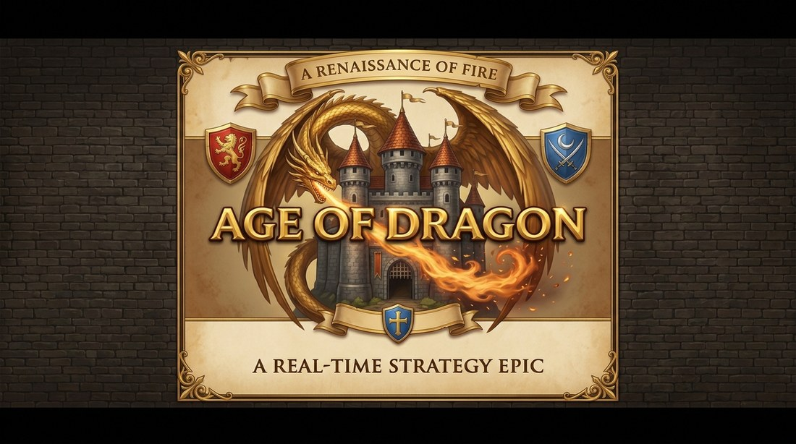
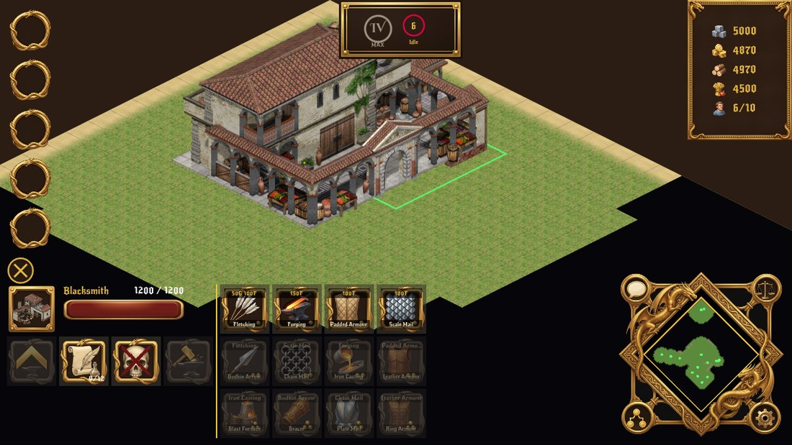
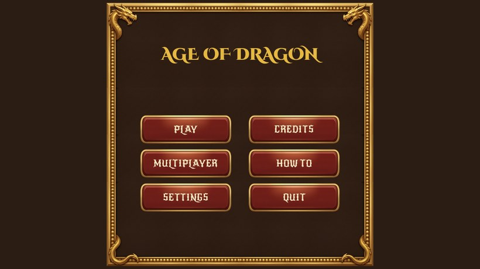

<p align="center">
  
</p>

<h1 align="center">Age of Dragon</h1>

<p align="center">
  <em>A real-time strategy epic — built for the phone first.</em>
</p>

<p align="center">
  <a href="LICENSE"></a>
  <a href="LICENSE-ART.md"></a>
  
  
</p>

---

> ### ⚠️ Read this first
>
> **It is playable, and it is a beta, not a release.** AOD is tagged **v0.9.0 — the first
> beta.** The MVP is achieved and the game is played on a phone: a map, units that gather
> and fight, buildings, five ages, a 27-entry tech tree, control groups, win conditions,
> multiplayer and five AI difficulties.
>
> **What is missing is named rather than glossed.** Of fifteen phases, four are closed
> outright and two have not started — **13, the dragons this game is named after, because
> `vis.dragon` has no rig and cannot walk, attack or die**; and 14, a declared ceiling
> where no AI rule can see its opponent. Several others are one or two items short. LAN
> discovery, save/load and chat transport are not built.
>
> **[PROGRESS.md](PROGRESS.md) is the status document** and is kept honest, phase by
> phase. Read it before judging anything here.

---

## What AOD aims to be

**Age of Empires II, with dragons, on a phone.**

That is the whole pitch. The proven RTS formula — villagers, resource gathering, build
queues, age advancement, tech trees, army composition — rebuilt for a landscape
touchscreen instead of a mouse and keyboard, and then given something AoE2 never had: a
**dragon**.

### The core loop, when it's done

Start with one Town Centre and five villagers. Pan and zoom an isometric map with your
thumbs. Tap a villager to select it, or pull two fingers apart to box-select a crowd.
Drop them into one of five control-group slots. Send them to chop wood, mine gold, hunt
deer. Watch the resource column climb in the top-right. Build a house, raise your
population cap, queue more villagers. Advance an age. Raise an army. Find the enemy.

### The dragon twist

Somewhere on the map is a **Dragon Nest** — a point of interest guarded by a full-grown
dragon. Kill it and the nest is yours; six minutes later it hatches a baby dragon for
you. A grown dragon has a castle's hit points and a castle's damage, ignores terrain
entirely because it flies, and breathes fire in an area. Rivals who can't take the nest
can still deny it to you by destroying it outright.

It is the single highest-value objective on any map, and it exists to give the mid-game
somewhere to point besides the enemy's front gate.

### Planned feature set

| | |
|---|---|
| **Platforms** | Android (primary), Windows and Linux (secondary), iOS later |
| **Orientation** | Landscape, locked |
| **Players** | 2–8; player count sets the map size |
| **Modes** | Standard conquest, plus capture-the-flag and king-of-the-hill |
| **Multiplayer** | Client–server. One player hosts, everyone connects |
| **Single player** | vs. state-machine AI with difficulty levels |
| **Map** | Procedural or hand-designed square grid, rendered isometric, with fog of war |
| **Economy** | Wood, food, gold, stone; deer, trees and gold mines in three sizes |
| **Progression** | Five ages, per-building upgrades, tech tree, population cap from houses and town centres |
| **Controls** | Tap to select, two-finger box select, five control groups, minimap tap-to-move, edge-swipe zoom |

Version tags follow `v0.1.0`–`v0.8.9` alpha, `v0.9.x` beta, `v1.0.0` release.

The full phase-by-phase breakdown is in **[Docs/IDEA.md](Docs/IDEA.md)**; the engineering
plan that implements it is **[PLAN.md](PLAN.md)**; where it has actually got to is
**[PROGRESS.md](PROGRESS.md)**.

---

## Screenshots

**These are captures of the running game, not mockups.** They used to be concept art; the
six `UI_Design*.jpg` files were retired on 2026-08-30 when the UI overhaul made them out of
date, and a picture of what the game actually looks like is worth more than a picture of
what it was going to look like. Regenerate them from `dev_preview/preview_match.tscn` and
`preview_menus.tscn`.

The look: readable sprites on an isometric field, gold-on-dark-brown chrome (`#E5B842` on
`#2B1D14`), everything sized for a thumb.

### Main HUD



Control groups down the left. Age and advancement progress across the top centre.
Resources top right. Selection and action panels bottom left. Ornate diamond minimap
bottom right with a button in each of its four corner bosses.

### Main menu



**Every pixel of chrome above is the project's own art**, and that is a licence fact as
much as an aesthetic one. Until 2026-08-30 the UI was third-party itch.io art whose terms
forbid redistributing the originals, so `game/assets/ui/` was gitignored and a clean clone
had no HUD at all — every developer downloaded two packs by hand. Replacing the lot with
owner-generated art retired that: **a clean clone now runs with its chrome intact.**

Typefaces are **Cinzel Decorative** for names and **New Rocker** for everything else, both
under the SIL Open Font License and both shipping beside their own licence text.

---

## How it's built

Four decisions shape everything else. They are worth knowing before reading any code.

**1. Solo play is not a special case.** Even a single-player match runs a real ENet
server on `127.0.0.1:27015` that the local client joins. There is no offline code path
to diverge from the online one, so multiplayer bugs surface on day one instead of at
phase 12.

**2. The simulation is server-authoritative and ticks at a fixed 10 Hz.** Rendering
interpolates between ticks to whatever the display can do. A phone at 60 fps and a phone
at 30 fps run the identical simulation.

**3. `src/sim/` is a hard boundary, enforced by a test.** Nothing under `src/sim/` may
extend `Node`, load a texture, read input, or reference the view layer. That is what
makes the entire game logic testable headlessly — 1779 tests and 208,740 assertions run
from one command — and it is checked by
[`test_sim_boundary.gd`](game/tests/sim/test_sim_boundary.gd) on every run, not by a
convention people forget.

**4. No filename ever appears in gameplay code.** Every visual and every sound sits
behind a stable ID (`vis.villager`, `terrain.grass`, `villager.chop`) resolved through a
JSON registry. Art ships as downloadable `.pck` packs rather than bloating the APK — and
re-skinning the entire game means swapping a pack, not editing code.

The determinism work that falls out of this is already in place: `state_hash()` proves
two runs of the same command log produce byte-identical worlds, and matches record to a
few-kilobyte replay file. Record a session on the phone, replay it headless on the
desktop to debug it.

### Verified on hardware

The game is played on a phone — a HONOR LNA-NX1 (Android 16, Mali-G610 MC2) — and has been
throughout. The numbers below are **the phase-0.7 stress-test measurement, and they predate
every sprite in the game**: 200 untextured units through the real
`host_solo() → SimHost → SnapshotSystem → Net → GameView` path. They are kept because the
budgets are still the budgets, not because they describe today's build.

| Metric | Measured (phase 0.7) | Budget |
|---|---|---|
| Sim tick cost | 0.39 ms avg | < 5 ms per 100 ms tick |
| Frame rate | 60 fps | 60 fps |
| Draw calls | 209 | < 200 |
| APK size | **320.6 MB** (2026-08-27) | < 300 MB |

⚠️ **Two of those want re-measuring before anyone quotes them.** The APK was over budget
when last built, and that build itself predates two art deliveries, three phases and the
whole UI overhaul. Draw calls were over budget at 0.7 with no art at all. **Re-measure on
the device; desktop numbers mean nothing for a mobile budget.**

---

## Current state

Summarised from [PROGRESS.md](PROGRESS.md), which is the authoritative version and carries
the detail of what each 🟢 is still short of.

| Phase | | |
|---|---|---|
| 0 | 🟢 | Foundation — sim, networking, `state_hash()`, replays, asset seam, licence audit. Left: `AssetPacks` (download, verify, mount) |
| 1 | 🟢 | Main menu, settings, credits, HOW TO PLAY, lobby. Left: server browser |
| 2 | 🟢 | Map generation, five biomes, Archipelago. Left: save map |
| 3 | 🟢 | Camera & world view. Left: camera-follow, tap-minimap-to-move |
| **4** | ✅ | **Units** — movement, combat, abilities, four stances, four formations, siege pack/unpack |
| 5 | 🟡 | Buildings — **up next**, and art-paced: 23 more buildings behind ~70 bakes |
| **6** | ✅ | **Resources & wildlife** |
| **7** | ✅ | **Resource HUD** |
| 8 | 🟢 | Main game interface. Left: chat has a wireframe but no transport |
| 9 | 🟢 | Ages cost resources and advance on a timer; 27 technologies at seven buildings. Left: civilisations, age re-skin — both art-paced |
| **10** | ✅ | **Control groups** |
| 11 | 🟢 | Win conditions — Conquest works; Regicide and Trophy are declared and inert |
| 12 | 🟡 | Multiplayer & five AI difficulties. Left: LAN discovery, campaign, save/load |
| **13** | ⛔ | **Dragons — not started, blocked on art.** `vis.dragon` has one clip, `static`. The unit is real and trainable from age 4 and has its fire breath; it cannot walk, attack or die |
| 14 | ⛔ | AI enemy-blindness — a declared ceiling, not a defect: no rule can see the opponent |

**1779 tests, 208,740 assertions, 0 failures.**

> **On phase 13, because it is the one this game is named after.** The dragon's mesh has no
> rig — verified against pristine upstream art, not inferred. It is 0 A.D.'s own model and
> CC-BY-SA, so rigging it is permitted and the mesh is only 454 triangles, but it is
> modelling work rather than a pipeline setting. See `asset_request.md` [P7].

---

## Getting started

```bash
git clone https://github.com/HermanRas/AgeOfDagrons.git
cd AgeOfDagrons
```

Open `game/` in **Godot 4.7.1-stable** — the version is pinned, and mixing versions is not
supported. **Point Godot at `game/`, not at the repository root**, or it will offer to
create a new project and you will wonder why nothing is there.

Press **F5** to boot into the menu and start a match. To run the test suite:

```bash
godot --headless --path game res://tests/run_tests.tscn
```

Exit code `0` = pass. **Nothing runs it for you** — there is no CI on this repo — so it is
a habit rather than a safety net.

Full instructions — desktop build, Android build from scratch with no Android Studio,
contributing, licensing, issues, and how to add or replace assets — are in
**[Docs/README.md](Docs/README.md)**.

---

## Repository layout

```
AgeOfDagrons/
├── game/                 ← the Godot project root (open THIS in Godot, not the repo root)
│   ├── src/sim/          the authoritative simulation — no Node, no rendering, no input
│   ├── src/net/          server-side sim host
│   ├── src/view/         isometric projection, pooled entity views, HUD
│   ├── src/autoload/     SimClock, Net, GameDataRegistry
│   ├── data/             the asset seam — visuals.json, units.json, techs.json, …
│   ├── assets/           UI art, fonts, audio, and the staged sprite atlases
│   ├── scenes/           menu, game and dev scenes
│   ├── dev_preview/      preview harnesses used to capture the screenshots above
│   └── tests/            headless test suite — one command, exit 0 or 1
├── tools/                asset-pipeline recipes and scripts (isobake is its own repo)
├── assets/               source art the pipeline consumes — UI_Gen sheets, HELP_Gen captures
├── Docs/                 build, contribute, licence, assets, design docs
├── PLAN.md               how we're building it — architecture, API, risks
├── PROGRESS.md           where it actually is, phase by phase
├── BUGS.md               owner-reported defects
├── asset_request.md      art the game side needs, requested per need
└── CREDITS.md            third-party attribution (a licence obligation, not a courtesy)
```

> **`game/assets/atlases/` is build output and is gitignored.** A fresh clone has no sprite
> atlases; the game falls back to its placeholder renderer and still runs. They are produced
> by the pipeline (`tools/`) and ship to players as downloadable packs, not through git.
> **UI art is the opposite** — that is committed in full, and has been since 2026-08-30.

## Related repositories

| Repo | What |
|---|---|
| [**blender_3d_to_2d_isobake**](https://github.com/HermanRas/blender_3d_to_2d_isobake) | The 3D→2D isometric sprite pipeline built for AOD, released separately because it isn't AOD-specific. GPL-2.0-or-later. |

## Licence

**Code is [MIT](LICENSE). Art and audio are [CC-BY-SA 3.0](LICENSE-ART.md).**

The split isn't arbitrary: the sprites are rendered from
[0 A.D.](https://play0ad.com)'s models, which are share-alike, so the derived art must be
too. The GDScript is ours and stays permissive. Reusing the art means attributing
**Wildfire Games** — see [CREDITS.md](CREDITS.md) for the exact wording the licence
requires.

## Credits

AOD stands on [0 A.D.](https://play0ad.com) by **Wildfire Games** and the
[Godot Engine](https://godotengine.org). The UI art is the project's own; the typefaces
are **New Rocker** and **Cinzel Decorative**, both under the SIL Open Font License.
UI chrome came from [Kibyra](https://kibyra.itch.io/) until 2026-08-30 and no longer does.
Full attribution: [CREDITS.md](CREDITS.md).
